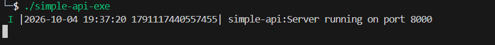
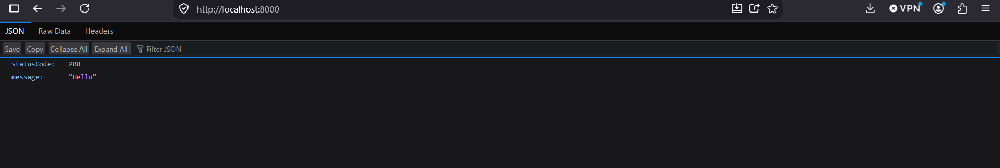
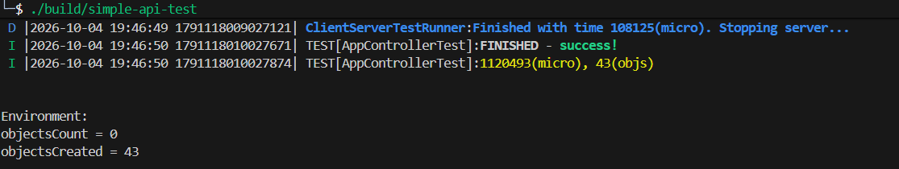

# oat++-simple-api

Current program directory listings:
```text
oat-simple-api
├── CMakeLists.txt
├── .env.example
├── .gitignore
├── README.md
├── src
│   ├── AppComponent.hpp
│   ├── App.cpp
│   ├── controller
│   │   └── AppController.hpp
│   ├── DotEnv.hpp
│   └── dto
│       └── MessageDto.hpp
├── test
│   ├── app
│   │   ├── AppApiTestClient.hpp
│   │   └── TestComponent.hpp
│   ├── AppControllerTest.cpp
│   ├── AppControllerTest.hpp
│   └── tests.cpp
└── test-result
    ├── api-running-on-port-8000.png
    ├── api-test-result.png
    └── server-running-indicator.png
```

Server Running Indicator:


Json result within browser (on http):


Api Call test result:
